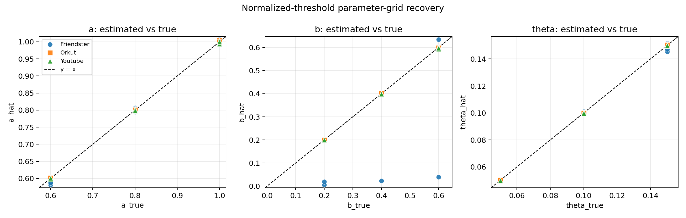
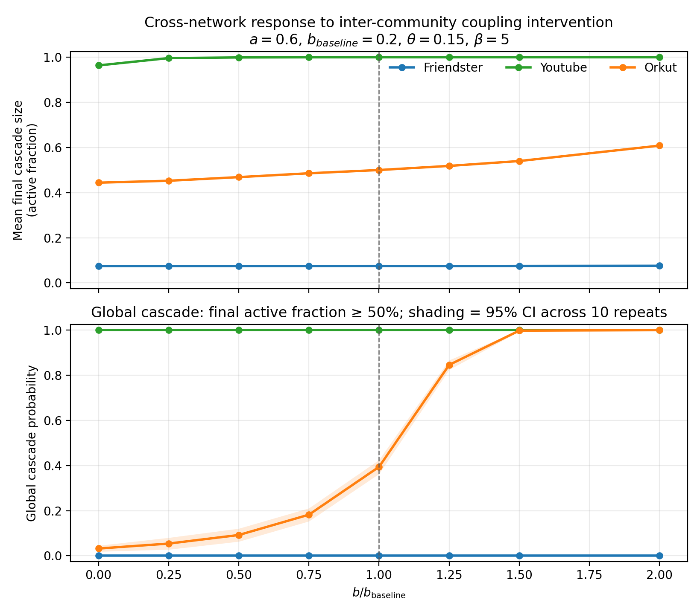
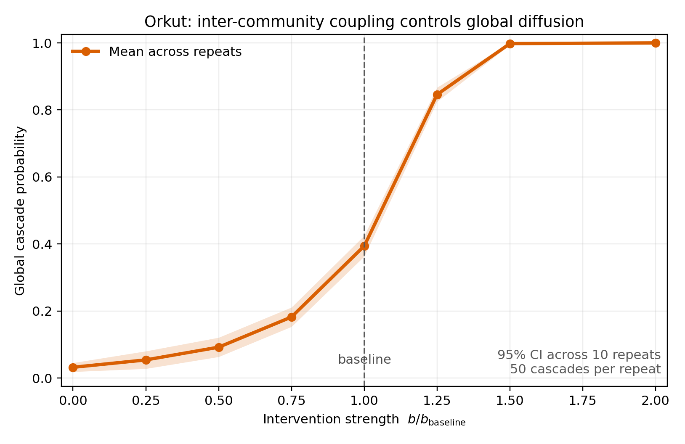

# data-driven-cosref

Parameter recovery, identifiability diagnostics, and inter-community
intervention experiments for probabilistic complex contagion on empirical SNAP
network topologies.

## Research question

Can the weights of within-community exposure (`a`), cross-community exposure
(`b`), and a normalized adoption threshold (`theta`) be recovered from
node-time cascade observations? Once recovered, how does changing the
cross-community coupling alter cascade size and the probability of global
diffusion across different empirical network structures?

## Relation to the Nature Communications paper

This repository is a standalone Python research companion to:

> **Community structure-regulation coupling reveals optimal information diffusion**  
> *Nature Communications* **17**, 4879 (2026).  
> https://doi.org/10.1038/s41467-026-73665-1

Xiaojie Chen and Meiling Xie contributed equally to the associated publication.

This repository does not contain, modify, or redistribute the paper’s original C++ simulation code.
> **Current experiments use synthetic cascades generated on empirical network
> topologies. They do not estimate causal effects from observed platform data.**

## Model

For an inactive node `i` at time `t`, let `m_in` be the number of active
neighbors in the same community, `m_out` the number in other communities, and
`degree` its total degree. Synchronous irreversible activation follows

```text
P(y_i(t)=1) = sigmoid(beta * (a*m_in + b*m_out - theta*degree)).
```

`theta` is normalized to `(0, 1)`. `beta` is fixed because the likelihood
identifies only the products `beta*a`, `beta*b`, and `beta*theta`. Logistic
regression uses

```text
y ~ m_in + m_out + degree
```

and maps its coefficients back as

```text
a_hat     =  coef_m_in / beta
b_hat     =  coef_m_out / beta
theta_hat = -coef_degree / beta.
```

See [docs/method_note.md](docs/method_note.md) for details.

## Experiments

- **Single-setting recovery** verifies the estimator on one empirical topology.
- **Parameter-grid recovery** evaluates 27 parameter combinations on
  Friendster, YouTube, and Orkut two-community subgraphs.
- **Identifiability diagnostics** explain when sparse cross-community exposure
  makes `b` weakly identifiable.
- **Inter-community intervention** varies `b / b_baseline` and measures mean
  final cascade size and global-cascade probability, with confidence intervals
  across independent random repeats.

The topology is empirical; the cascade realizations and activation outcomes are
synthetic draws from the model above.

## Current results

### Parameter recovery

For the reference Friendster setting `a=0.8`, `b=0.4`, `theta=0.1`, and
`beta=5`, the estimates were:

| Parameter | True | Estimated | Relative error |
|---|---:|---:|---:|
| `a` | 0.8000 | 0.7875 | 1.57% |
| `b` | 0.4000 | 0.3949 | 1.26% |
| `theta` | 0.1000 | 0.0985 | 1.53% |

Across the 27-point parameter grid, mean relative error averaged over `a`, `b`,
and `theta` was 5.19% for Friendster, 0.27% for YouTube, and 0.19% for Orkut.



### Friendster identifiability failure

At `a=0.6`, `b=0.2`, and `theta=0.15`, Friendster returned
`b_hat=0.0059`. This is not primarily a collinearity problem:

- only 11.85% of Friendster edges are cross-community;
- only 2.45% of exposure rows have `m_out > 0`;
- the positive outcome rate is 0.392%;
- only 0.52% of positive outcomes have `m_out > 0`.

The regression therefore has almost no cross-community activation signal from
which to identify `b`. Under the identical parameters, YouTube and Orkut recover
`b` near its true value of 0.2. Full values are in
[outputs/identifiability_diagnostics.csv](outputs/identifiability_diagnostics.csv).

### Cross-network intervention

With `a=0.6`, `b_baseline=0.2`, `theta=0.15`, and `beta=5`, Friendster remains
subcritical and YouTube remains globally supercritical over the tested range.
Orkut occupies the intervention-sensitive regime: its global-cascade
probability rises from 0.394 at baseline to 0.846 at
`b / b_baseline = 1.25` and 0.998 at `1.5`.





## Repository structure

```text
data-driven-cosref/
├── README.md
├── requirements.txt
├── LICENSE
├── .gitignore
├── scripts/
│   ├── cosref_core.py
│   ├── parameter_recovery.py
│   ├── parameter_grid_recovery.py
│   ├── identifiability_diagnostics.py
│   ├── intercommunity_intervention.py
│   └── run_all.py
├── docs/
├── outputs/
└── data/
    └── README.md
```

## Installation

Python 3.10 or newer is recommended.

```bash
git clone <repository-url>
cd data-driven-cosref
python -m venv .venv
source .venv/bin/activate
python -m pip install --upgrade pip
python -m pip install -r requirements.txt
```

On Windows, activate the environment with `.venv\Scripts\activate`.

## Data preparation

SNAP data are not distributed in this repository. Prepare consistently
remapped edge and community CSV files as described in
[data/README.md](data/README.md), then place them in `data/`.

## Reproducing the experiments

Run all four experiments:

```bash
python scripts/run_all.py --data-dir data --outputs-dir outputs
```

Run a fast, data-free smoke test on a built-in toy graph:

```bash
python scripts/run_all.py --demo --quick --outputs-dir outputs/smoke
```

Individual entry points expose reproducibility controls such as
`--random-seed`, `--n-cascades`, `--max-steps`, `--seed-size`, `--max-nodes`,
and parameter values:

```bash
python scripts/parameter_recovery.py --help
python scripts/parameter_grid_recovery.py --help
python scripts/identifiability_diagnostics.py --help
python scripts/intercommunity_intervention.py --help
```

## Limitations

- Cascades are generated by the same model family used for recovery, so the
  experiment measures parameter recoverability under controlled specification,
  not robustness to model misspecification.
- Community labels and the network topology are treated as observed and fixed.
- `beta` is fixed rather than jointly estimated.
- Pointwise logistic regression does not yet model within-cascade dependence or
  provide cluster-robust uncertainty for recovered parameters.
- A global cascade is operationally defined as a final active fraction of at
  least 50%.
- The intervention changes a model parameter; it is not a causal estimate from
  an observed platform intervention.

## Next stage: observed cascades

The next phase will replace simulated activation histories with timestamped
real-cascade data, align exposures to observation windows, address missing and
censored events, estimate uncertainty at the cascade level, test temporal and
network misspecification, and define a causal identification strategy before
interpreting intervention effects.

## License and data

The new Python code is released under the MIT License. SNAP datasets retain
their original terms and are not included. The paper and its original C++ code
are not relicensed or redistributed by this repository.
