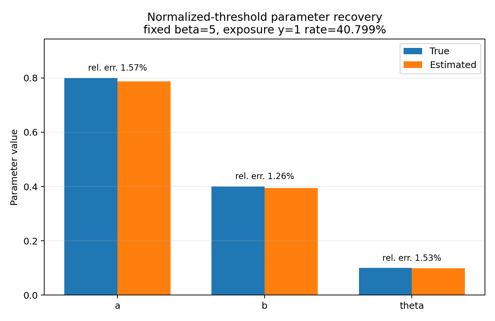

# data-driven-cosref

This repository connects a two-community count-threshold contagion model to reproducible synthetic experiments and an observational Digg cascade case study. The synthetic stage tests whether known parameters can be recovered and how simulated cascades respond to changes in cross-community coupling. The Digg stage audits real cascades, stress-tests the linear model, and evaluates calibrated prediction under strict story-level validation. The real-data results are predictive associations, not causal findings.

## 1. Project overview

The project is a standalone Python research companion to **“Community structure-regulation coupling reveals optimal information diffusion,”** *Nature Communications* **17**, 4879 (2026) ([DOI: 10.1038/s41467-026-73665-1](https://doi.org/10.1038/s41467-026-73665-1)). Xiaojie Chen and Meiling Xie contributed equally to the associated publication. This repository does not contain, modify, or redistribute the paper's original C++ simulation code. Public outputs are deliberately limited to compact summaries, reports, and figures; raw and row-level data remain local.

### Version history

**v1.0 — synthetic parameter recovery**

- Synthetic cascades on empirical network topologies;
- Logistic Regression parameter recovery;
- Recovery of `a`, `b`, and `theta`;
- Parameter-grid validation;
- Identifiability diagnostics; and
- Synthetic/model-based intervention experiments.

**v2.0 — real cascades and calibrated prediction**

- Digg real-cascade data audit and preprocessing;
- Time-respecting baseline friendship network;
- Community detection and exposure-table construction;
- M0/M1 observational logistic baselines;
- Diagnosis of the limits of interpreting real-data coefficients as physical `a`, `b`, and `theta`;
- XGBoost context/full feature ablation;
- Story-level grouped cross-validation;
- SHAP interpretation;
- Platt probability calibration; and
- Reproducibility tests and provenance documentation.

The v2.0 work extends and retains the complete v1.0 synthetic pipeline. See [CHANGELOG.md](CHANGELOG.md) for the release-level summary.

## 2. Research question

The synthetic experiments ask whether within-community influence `a`, cross-community influence `b`, and normalized threshold `theta` can be recovered when their true values are known, and how a controlled change in `b` changes simulated diffusion. The Digg study asks a narrower observational question: do count exposures `m_in` and `m_out` add held-out predictive value beyond degree, elapsed time, user activity, and cascade popularity?

## 3. COSREF count-threshold model

For inactive node `i`, let `m_in` and `m_out` be the counts of previously active influence neighbors in the same and other community, and let `degree` be the relevant influence in-degree. The synthetic activation rule is

```text
P(y_i(t)=1) = sigmoid[beta * (a*m_in + b*m_out - theta*degree)].
```

`beta` is fixed at 5 because the likelihood identifies the products `beta*a`, `beta*b`, and `beta*theta`. With correctly specified synthetic data, the raw logistic coefficients map to `a_hat=coef_m_in/beta`, `b_hat=coef_m_out/beta`, and `theta_hat=-coef_degree/beta`.

For Digg, M1 is a probability model inspired by that count rule:

```text
P(y=1) = sigmoid[
    c + beta*(a*m_in + b*m_out - theta*degree)
      - time controls
].
```

The intercept `c` absorbs unobserved baseline influences such as platform promotion. Digg coefficients are observational effective associations and are not structural recovery of true `a`, `b`, or `theta`. No normalized-exposure model is fitted. See [the method note](docs/method_note.md).

## 4. Repository structure

```text
data-driven-cosref/
├── README.md
├── CHANGELOG.md
├── LICENSE
├── requirements.txt
├── data/
│   ├── README.md
│   ├── raw/digg2009/            # local only; ignored
│   └── processed/               # local only; ignored
├── docs/
│   ├── method_note.md
│   ├── reproducibility.md
│   ├── snap_input_provenance.md
│   ├── digg_observational_case_study.md
│   └── digg_xgboost_results.md
├── scripts/
│   ├── cosref_core.py
│   ├── parameter_recovery.py
│   ├── parameter_grid_recovery.py
│   ├── identifiability_diagnostics.py
│   ├── intercommunity_intervention.py
│   ├── prepare_snap_two_community.py
│   ├── audit_digg.py
│   ├── prepare_digg.py
│   ├── build_digg_exposure_pilot.py
│   ├── fit_digg_pilot_models.py
│   ├── diagnose_digg_pilot.py
│   ├── fit_digg_controlled_models.py
│   ├── analyze_digg_two_community.py
│   ├── fit_digg_xgboost.py
│   ├── validate_digg_xgboost.py
│   ├── validate_digg_xgboost_group_cv.py
│   ├── finalize_digg_xgboost.py
│   ├── run_all.py
│   └── run_digg_pipeline.py
├── tests/                       # fast, data-free core checks
└── outputs/                     # compact public results only
```

## 5. Synthetic parameter recovery

At the reference Friendster setting `a=0.8`, `b=0.4`, `theta=0.1`, and `beta=5`, the fitted estimates were `0.7875`, `0.3949`, and `0.0985`, corresponding to relative errors of 1.57%, 1.26%, and 1.53%. Across the 27-point parameter grid, mean relative error averaged over the three parameters was 5.19% for Friendster, 0.27% for YouTube, and 0.19% for Orkut.




## 6. Cross-network validation

The same recovery procedure is run on consistently prepared two-community Friendster, YouTube, and Orkut subgraphs. A diagnostic Friendster setting has very sparse cross-community positive exposure, so `b` is weakly identified there even though YouTube and Orkut recover the same known value. This is a data-support limitation rather than evidence for a universal topology effect; full values are in [the identifiability summary](outputs/identifiability_diagnostics.csv).

## 7. Synthetic intervention experiment

The intervention varies `b/b_baseline` while holding the synthetic data-generating model fixed. At `a=0.6`, `b_baseline=0.2`, `theta=0.15`, and `beta=5`, Orkut lies in the intervention-sensitive regime: simulated global-cascade probability rises from 0.394 at baseline to 0.846 at ratio 1.25 and 0.998 at 1.5. This is a model intervention, not a causal estimate from an observed platform intervention.


## 8. Digg real-cascade pipeline

The Digg pipeline cleans duplicate votes, constructs a friendship network using only links present no later than the earliest vote, detects Leiden communities on an undirected copy, and keeps the directed influence orientation `friend_id -> user_id` for exposure. It then selects 100 pilot cascades with seed 42, builds hourly risk sets, retains all positives, samples five negatives per positive, and stores inverse-sampling weights. Exposures and context controls use only information strictly before each window; validation groups by `story_id`.

The full-network community analysis is retained alongside a prespecified two-community induced-subsystem stress test. The community pair was selected by network size and cross-community edge count, without using votes or coefficient signs. Neither result is used to relabel communities after seeing the outcome.

## 9. M0/M1/XGBoost comparison

- **M0:** logistic baseline with `degree` and `log1p(time_bin)`, but no network exposure.
- **M1:** probabilistic count-threshold model adding `m_in` and `m_out` to the same degree and time definition.
- **XGB_context:** XGBoost using `degree`, `log1p(time_bin)`, `log_user_activity`, and `log_cascade_size`.
- **XGB_full:** XGB_context plus `m_in` and `m_out`.
- **Final model:** Platt-calibrated XGB_full, using calibration stories drawn only from each training fold.

The linear Digg stress tests converge normally. `m_in` is stably positive, but `m_out` remains negative in the two-community specification and the degree coefficient is positive, so `theta_eff=-coef_degree/5` does not have the paper's threshold meaning. These are specification and data-fit findings, not optimizer failure.

## 10. Feature ablation

XGB_base uses only degree and elapsed time. Adding user activity and cascade popularity produces the main ranking improvement. Adding `m_in` and `m_out` to XGB_context provides extra but limited rare-adopter ranking value; it does not justify a causal exposure interpretation.


## 11. Grouped cross-validation

Five-fold group cross-validation uses `group=story_id`, 80 training stories and 20 held-out stories per fold, fixed features, and `sampling_weight` for fitting and metrics. XGB_full raises mean PR-AUC from `0.0113434` to `0.0130119`, about **14.7%**, but exceeds XGB_context in only 3/5 folds. The story-cluster bootstrap interval for the pooled PR-AUC increment is `[-0.003924, 0.005473]`, so the cross-cascade gain is not uniformly stable. Before calibration, XGB_base has the best mean Brier score (`0.000137264`); that lower-is-better result is intentionally not attributed to XGB_context.

See [the grouped-CV summary](outputs/digg/xgb_group_cv_summary.md) and [full XGBoost report](docs/digg_xgboost_results.md).

## 12. Platt calibration

For each outer fold, 16 stories are separated from the 80 training stories for Platt calibration; model fitting uses the remaining 64, and the 20 test stories never participate in fitting or calibration. All stages use `sampling_weight`. Calibration improves probability quality and, because the fitted sigmoid is monotone, leaves ROC-AUC and PR-AUC effectively unchanged.

Calibrated XGB_full has slightly lower log loss than calibrated XGB_context and a Brier score only 0.19% higher. Under the prespecified 1% closeness rule it is retained as the final pilot model, while the small Brier difference remains visible.


## 13. Main results

Mean held-out metrics across the five nested folds are copied from [the final metrics CSV](outputs/digg/final_model_metrics.csv):

| Model | Calibration | Log loss | Brier | ROC-AUC | PR-AUC |
| ------------ | ----------- | ---------: | ----------: | ------: | --------: |
| XGB_context | None | 0.00115873 | 0.000138104 | 0.90114 | 0.0108215 |
| XGB_context | Platt | 0.00114086 | **0.000137012** | 0.90114 | 0.0108215 |
| XGB_full | None | 0.00115810 | 0.000140878 | 0.90323 | 0.0117310 |
| **XGB_full** | **Platt** | **0.00113033** | 0.000137271 | **0.90323** | **0.0117310** |

Platt XGB_full has the best log loss, ROC-AUC, and PR-AUC; Platt XGB_context has a slightly better Brier score. User activity and cascade popularity supply the main predictive gain, while `m_in`/`m_out` add limited rare-adopter ranking value. The SHAP display summarizes held-out predictive associations only.


## 14. Limitations

- The synthetic recovery model matches the synthetic data generator; it does not establish robustness to arbitrary misspecification.
- A deterministic SNAP converter is included, but the original source community IDs used for the historical formal inputs were not recovered. Existing prepared graphs are hash-audited and semantically reproducible from their current `0/1` mappings; see [the provenance audit](docs/snap_input_provenance.md).
- The code, tests, and experiments are reproducible from the prepared inputs identified by checksums. However, the original SNAP community IDs used to construct the historical two-community inputs were not preserved, so exact end-to-end reconstruction of that historical community selection from the upstream SNAP release is not guaranteed.
- `beta` is fixed, community labels and topology are treated as observed, and within-cascade dependence is simplified.
- Synthetic changes in `b` are controlled simulation interventions, not observed causal platform interventions.
- The Digg analysis uses 100 pilot cascades, not all 3,553 cascades, and is sensitive to unobserved recommendation exposure, network incompleteness, and inverse-sampling assumptions.
- SHAP and all Digg regression coefficients describe prediction or association, not causal effects.
- Digg's `m_out` and implied `theta` estimates are unstable or outside the intended physical interpretation. Recovery claims for `a`, `b`, and `theta` come only from synthetic experiments.

## 15. Reproduction instructions

Python 3.9 or newer is supported; **Python 3.10 is recommended** for reproduction. Install the recorded runtime dependencies with:

```bash
python -m venv .venv
source .venv/bin/activate
python -m pip install -r requirements.txt
```

Digg community detection imports `igraph` and uses its built-in `Graph.community_leiden`; formal preprocessing recorded `igraph==1.0.0`. No separate `leidenalg` package is imported. On macOS, XGBoost may also require `brew install libomp`. Prepare the SNAP and Digg files exactly as described in [data/README.md](data/README.md).

For the minimal test suite, install the separate development requirements and run pytest:

```bash
python -m pip install -r requirements-dev.txt
python -m pytest -q
```

### Synthetic experiments

When the two original community IDs are known, inspect the deterministic SNAP preparation CLI with:

```bash
python scripts/prepare_snap_two_community.py --help
```

```bash
python scripts/run_all.py --data-dir data --outputs-dir outputs
```

A lightweight, data-free interface test is:

```bash
python scripts/run_all.py --demo --quick --outputs-dir outputs/smoke
```

This smoke test is fast and does not reproduce the reported full-size results.

### Digg audit and preprocessing

```bash
python scripts/audit_digg.py
python scripts/prepare_digg.py
```

### Community detection

Leiden detection is part of `prepare_digg.py`; the two-community network audit is a separate prespecified stress test:

```bash
python scripts/analyze_digg_two_community.py
```

### Pilot exposure construction

```bash
python scripts/build_digg_exposure_pilot.py
```

### Logistic baselines

```bash
python scripts/fit_digg_pilot_models.py
python scripts/diagnose_digg_pilot.py
python scripts/fit_digg_controlled_models.py
```

`analyze_digg_two_community.py` also rebuilds and fits the fixed two-community pilot as one exploratory step.

### XGBoost training and ablation

```bash
python scripts/fit_digg_xgboost.py
python scripts/validate_digg_xgboost.py
```

### Grouped cross-validation

```bash
python scripts/validate_digg_xgboost_group_cv.py
```

### Platt calibration

```bash
python scripts/finalize_digg_xgboost.py
```

### Figure generation

Figures are generated by the corresponding experiment scripts above; there is no separate figure-only command. The complete Digg order can be previewed or run with the checked-in orchestrator:

```bash
python scripts/run_digg_pipeline.py --dry-run
python scripts/run_digg_pipeline.py
```

The second command is intentionally expensive and is not needed for a smoke check. Scripts with configurable CLI parameters document their real options through `--help`; scripts without an argument parser use project-relative defaults.

The complete Digg pipeline requires the two local raw files and is substantially slower than the smoke test. This repository includes precomputed compact summary CSVs, Markdown reports, and final figures so that reported conclusions can be inspected without rebuilding row-level data. The full Digg pipeline was **not rerun during the final repository audit**.

Formal seeds, principal parameters, input SHA-256 values, and key output names are recorded in [the reproducibility record](docs/reproducibility.md). Synthetic prepared-input hashes and community sizes are recorded separately in [the SNAP provenance audit](docs/snap_input_provenance.md).

## 16. Data availability and citation

Synthetic network inputs are obtained separately from SNAP and retain their upstream terms. Digg raw data are not included; download the [official Digg 2009 Figshare archive](https://figshare.com/articles/dataset/Digg_2009_social_news_votes_and_graph/2062467), place its two files under `data/raw/digg2009/`, and follow the license and citation instructions in [data/README.md](data/README.md). Cite the underlying study as [Hogg and Lerman (2012), “Social Dynamics of Digg”](https://doi.org/10.1140/epjds5).

The new Python code is released under the MIT License. Raw data, processed data, compressed or full exposure tables, environment files, and serialized fitted objects are intentionally excluded from Git.
