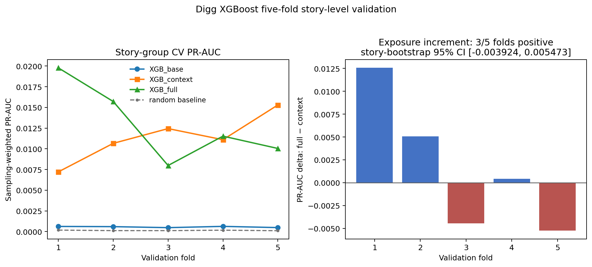
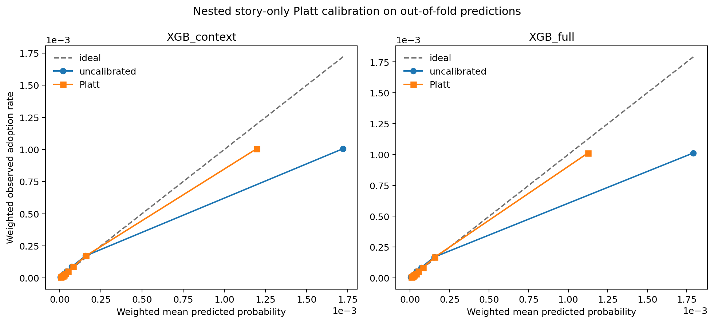
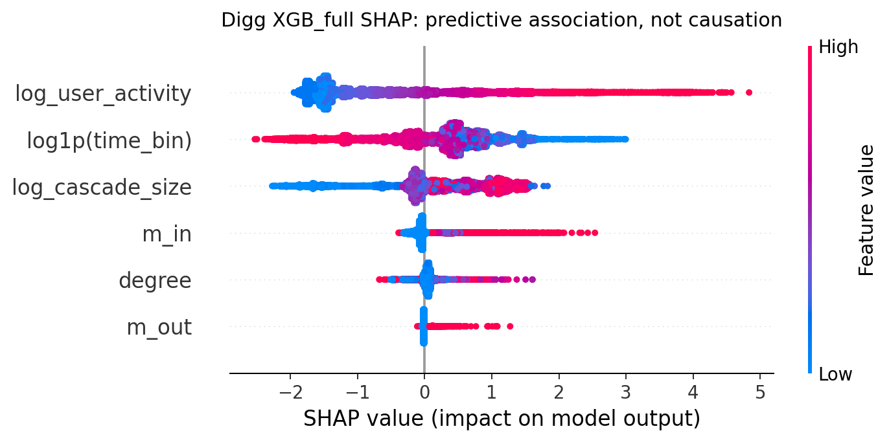

# Digg XGBoost validation results

## Scope

This validation adds no random forest, neural network, GNN, or other predictive model. It evaluates only the existing fixed-specification XGBoost, plus a one-dimensional Platt probability-calibration layer fitted exclusively on internal training stories.

All results remain observational prediction on the 100-cascade pilot. No community definition, M1 coefficient, exposure sign, or structural parameter is adjusted.

## Held-out feature ablation

All variants use identical XGBoost parameters, sampling weights, and the saved 80/20 story split.

| model | features | log loss | Brier | ROC-AUC | PR-AUC |
|---|---|---:|---:|---:|---:|
| XGB_base | degree;log1p(time_bin) | 0.001424912391 | **0.0001516215609** | 0.7394025188 | 0.0005594022679 |
| XGB_context | degree;log1p(time_bin);log_user_activity;log_cascade_size | 0.001251234386 | 0.0001524467398 | 0.8989289792 | 0.005352667374 |
| XGB_full | degree;log1p(time_bin);log_user_activity;log_cascade_size;m_in;m_out | **0.001245344393** | 0.0001522431093 | **0.9018507826** | **0.009664626652** |

Adding `m_in/m_out` to XGB_context changes log loss by **-5.889993906e-06**, Brier by **-2.03630586e-07**, ROC-AUC by **+0.002921803342**, and PR-AUC by **+0.004311959278**. Negative loss/Brier deltas and positive AUC deltas indicate improvement.

This is the direct predictive test of whether community exposure counts add information beyond degree, time, user activity, and cascade heat.

## Five-fold group cross-validation

Each fold holds out 20 complete stories; no story crosses a fold. Values below are unweighted means and sample standard deviations across the five independently weighted fold metrics.

| model | log loss mean±SD | Brier mean±SD | ROC-AUC mean±SD | PR-AUC mean±SD |
|---|---:|---:|---:|---:|
| XGB_base | 0.001297126022 ± 0.0002841437258 | **0.0001372643478 ± 3.41079403e-05** | 0.7603060021 ± 0.01638337974 | 0.0005620598876 ± 7.603716247e-05 |
| XGB_context | **0.001146341016 ± 0.0002835084658** | 0.00013762846 ± 3.445500077e-05 | 0.901622035 ± 0.01381785472 | 0.0113434093 ± 0.00293167308 |
| XGB_full | 0.001148791052 ± 0.0002702337526 | 0.0001393671952 ± 3.228394519e-05 | **0.9037100387 ± 0.01390555248** | **0.01301190319 ± 0.00472756979** |

Across folds, XGB_full minus XGB_context changes mean log loss by **+2.450036035e-06**, Brier by **+1.738735195e-06**, ROC-AUC by **+0.00208800373**, and PR-AUC by **+0.001668493898**. Exposure counts improve mean ranking metrics but do not improve mean log loss or Brier, so their incremental predictive value is metric-dependent rather than uniformly stable.

XGB_full's mean PR-AUC is **14.7% higher** than XGB_context
(`0.0130119 / 0.0113434 - 1`). It wins on PR-AUC in only 3/5 folds, however,
and the 1,000-replicate story-cluster bootstrap interval for the pooled PR-AUC
increment is `[-0.003924, 0.005473]`. The exposure ranking gain is therefore
additional but limited, not uniformly stable across cascades.

Per-fold metrics are available in `outputs/digg/xgb_group_cv_metrics.csv`.

## Nested Platt calibration

Calibration is nested inside every outer group-CV fold. From each fold's 80
training stories, 64 stories fit XGBoost and 16 disjoint stories fit a weighted
Platt intercept and slope. The 20 outer test stories are used only once, for
evaluation. All ten Platt fits converged without warnings and had positive
slopes; no outer test fold was used for scaling, tuning, early stopping, or
calibration.

The table reports the mean of the five outer-fold weighted metrics. Raw and
calibrated rows for a model use the same 64-story XGBoost fits, so changes isolate
the calibration layer.

| model | probability | log loss | Brier | ROC-AUC | PR-AUC |
|---|---|---:|---:|---:|---:|
| XGB_context | uncalibrated | 0.001158730078 | 0.0001381039867 | 0.9011408905 | 0.01082147118 |
| XGB_context | Platt | 0.001140860217 | **0.0001370120303** | 0.9011408904 | 0.01082147154 |
| XGB_full | uncalibrated | 0.001158096894 | 0.0001408778349 | 0.9032276891 | 0.01173103097 |
| XGB_full | Platt | **0.001130334020** | 0.0001372708131 | **0.9032276885** | **0.01173103113** |

As required for monotone Platt transforms, ROC-AUC and PR-AUC are unchanged up
to numerical ties. Calibration improves both log loss and Brier for both
models. Calibrated XGB_full has 0.92% lower log loss and only 0.19% higher Brier
than calibrated XGB_context. Under the predeclared rule that both probability
errors may be no more than 1% worse, **calibrated XGB_full is retained as the
final pilot model** rather than hiding its small Brier disadvantage.

## Held-out interpretation

SHAP values use a deterministic uniform sample of **20,000 test rows**. They explain the fitted XGB_full predictor; they are not causal effects and do not identify diffusion mechanisms.

| feature | XGBoost gain | mean absolute SHAP |
|---|---:|---:|
| log_user_activity | 1432.054565 | 1.22337389 |
| log1p(time_bin) | 298.9739075 | 0.6795192957 |
| log_cascade_size | 176.3944092 | 0.6397704482 |
| degree | 127.3841476 | 0.08028498292 |
| m_in | 104.4876022 | 0.117207773 |
| m_out | 48.71442413 | 0.02236545272 |

The `m_in` and `m_out` dependence plots show heterogeneous fitted contributions conditional on the other observed features. They must not be read as dose-response or causal exposure effects.

## Final interpretation

1. User activity and cascade heat contribute the main prediction improvement:
   moving from XGB_base to XGB_context produces the large change in held-out and
   group-CV discrimination.
2. `m_in` and `m_out` add limited ranking value. Mean PR-AUC increases about
   14.7%, but only 3/5 folds improve and the story-bootstrap interval crosses
   zero.
3. Before calibration, XGB_full has slightly worse average probability error;
   XGB_base—not XGB_context—has the lowest uncalibrated Brier score.
4. Nested Platt calibration materially improves XGB_full probability error and
   leaves ranking essentially unchanged. Calibrated XGB_full is the final pilot
   model under the recorded 1% closeness rule.
5. SHAP values explain predictive associations in the fitted model. They are
   not causal effects, dose-response curves, or diffusion-mechanism estimates.
6. The Digg linear fits retain a negative `m_out` coefficient and a positive
   degree coefficient. Digg therefore does not support interpreting these as
   the paper's true `b` and `theta`.
7. Recovery of known `a`, `b`, and `theta` belongs exclusively to the synthetic
   stage, where cascades are generated from known parameters.

The final model remains a 100-cascade observational pilot. It is not expanded
to all 3,553 cascades and is not used for a real-data intervention.
